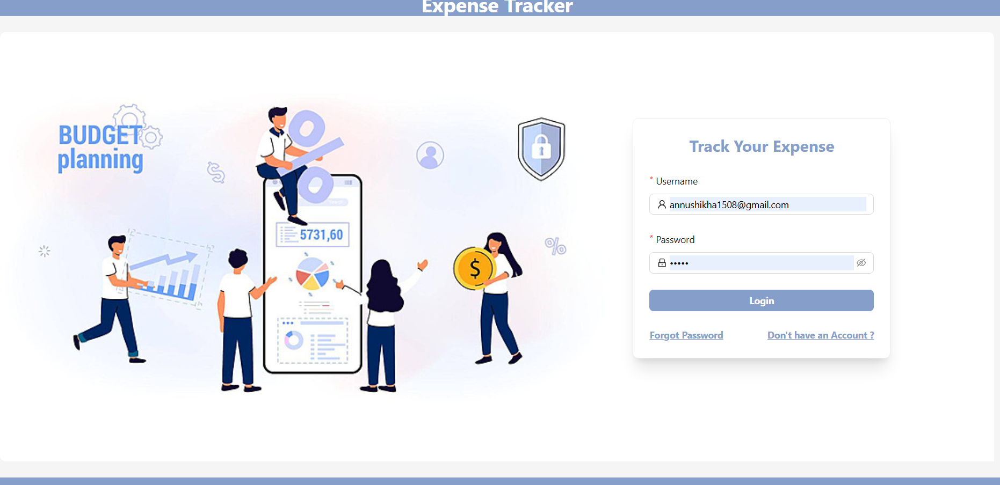
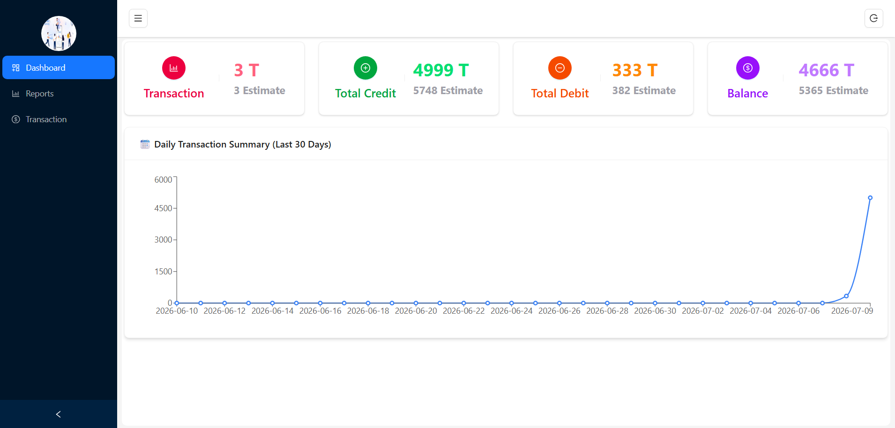
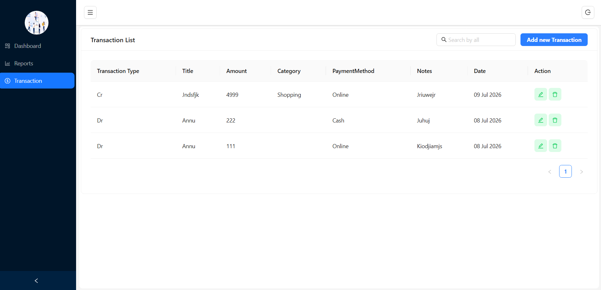
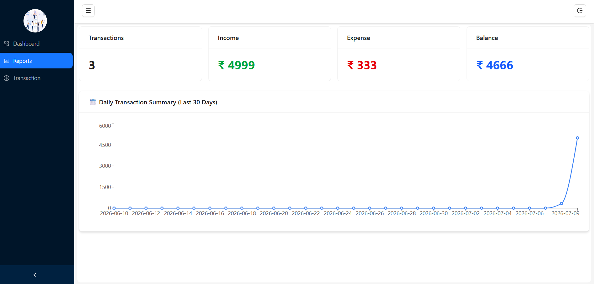

# 💰 Expense Tracker

A full-stack Expense Tracker application built with the MERN Stack. It helps users manage income and expenses, view financial summaries, and analyze spending through an interactive dashboard and reports.

---

## 🚀 Features

- 🔐 User Authentication (Login & Signup)
- 👤 Role-Based Access
- 📊 Dashboard with Summary Cards
- 💳 Add, Edit & Delete Transactions
- 📈 Reports & Analytics
- 📅 Daily Transaction Chart
- 📱 Responsive UI
- ⚡ Secure REST API

---

## 🛠 Tech Stack

### Frontend
- React.js
- Ant Design
- Tailwind CSS
- Axios
- Recharts

### Backend
- Node.js
- Express.js
- MongoDB
- Mongoose
- JWT Authentication

---

## 📂 Project Structure

```text
expense-tracker
│
├── backend
├── frontend
├── screenshots
├── README.md
└── .gitignore
```

---

## ⚙️ Installation

### Clone Repository

```bash
git clone https://github.com/Annushikha2211/expense-tracker.git
```

### Backend

```bash
cd backend
npm install
npm run dev
```

### Frontend

```bash
cd frontend
npm install
npm run dev
```

---

## 📸 Screenshots

### Login



### Dashboard



### Transactions



### Reports



---

## 📌 Future Improvements

- Export Reports as PDF
- Budget Planning
- Monthly Analytics
- Email Notifications

---

## 👨‍💻 Author

**Annushikha verma**
